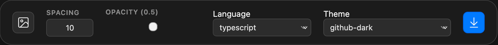

# Code Preview to Image

> **Create beautiful code screenshots with standard macOS window aesthetics, loba-style glassmorphism blur effects, and flawless Shiki syntax highlighting.**

This application allows you to edit code dynamically, apply syntax highlighting in real-time, customize spacing and background images (including uploading your own), adjust terminal glass opacity dynamically, and export high-resolution PNG renders with a single click.

🔗 **Live Preview:** [https://code-preview-2-image.vercel.app/](https://code-preview-2-image.vercel.app/)

---

## Feature Showcases

### 1. Fully Customizable (Python, Custom Background, Theme)
Select from a wide array of programming languages and professional Shiki themes. The terminal window automatically shrinks or grows to perfectly fit your code length, ensuring no artificial stretching.


### 2. Smooth Translucent Opacity (Glassmorphism)
Control the background transparency of your terminal window. No matter what opacity you choose (even down to 0.4), a rich macOS-style glassmorphism blur is preserved, while the code text and title bar controls remain 100% sharp and legible.

| Opacity: 40% (opacity-0.4) | Opacity: 100% (opacity-1.0) |
| :---: | :---: |
|  |  |

---

## Key Features

The application features a beautifully polished macOS-style floating control panel designed for simple, direct, and powerful customization of your code snapshot:



- **Custom Background:** Click the local file picker icon to upload and apply any image from your computer instantly as the backdrop of your code screenshot.
- **Translucent Opacity Slider:** Dynamically scale the terminal's background transparency from 0 to 100%. Even at low opacity values, a gorgeous native-style glass blur is maintained behind the window.
- **Dynamic Spacing (Padding):** Control the padding margins surrounding the terminal. On small viewports, the margin automatically clamps down to prevent squeezing the code editor area.
- **Language Syntax Highlighting:** Instantly switch between languages (such as TypeScript, Python, and CSS). The syntax highlight updates immediately as you edit.
- **Theme Color Selection:** Choose from numerous professional Shiki code themes (including github-dark, monokai, solarized-light) to fit your preferred aesthetic.
- **IDE-Like Editor Formatting:** Write and format code naturally. Tab key presses insert exactly 4 spaces instead of shifting browser focus.
- **Responsive Layout:** Adaptive fonts scale dynamically on smaller screens using CSS clamp(), keeping code fully readable on mobile devices.
- **High-Quality PNG Export:** The Save button renders the entire container with lossless quality using html-to-image and downloadjs.

---

## Technology Stack & Dependencies

Built with zero bloat and standard modern libraries for unmatched speed and reliability:
- **Vite:** Next-generation frontend tooling and bundler.
- **CSS3 & HTML5:** Standard clean classes, no bulky layout libraries.
- **Shiki (NPM):** Direct local bundler integration for lightning-fast syntax highlighting.
- **html-to-image:** Captured element canvas-to-PNG renderer.
- **downloadjs:** Seamless file downloads in client environment.

---

## Local Setup

1. Install dependencies:
   ```bash
   npm install
   ```
2. Run development server:
   ```bash
   npm run dev
   ```
3. Build for production (compiled to dist/ directory):
   ```bash
   npm run build
   ```
