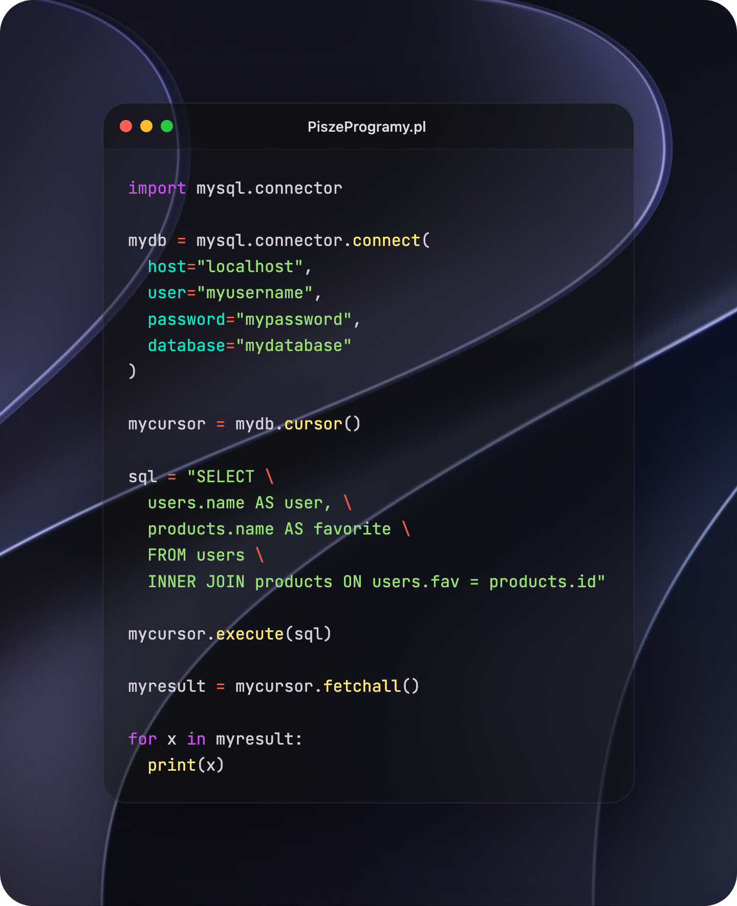
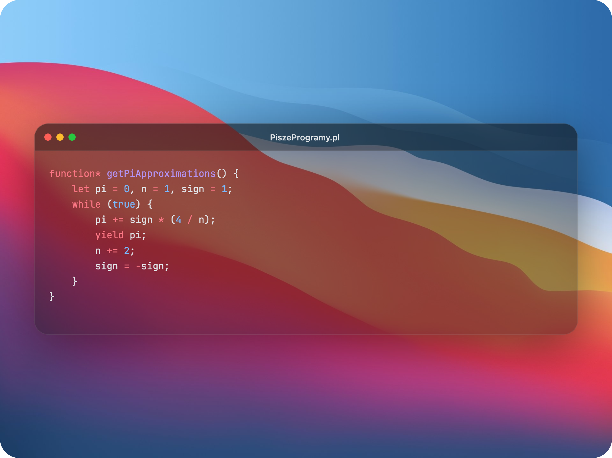
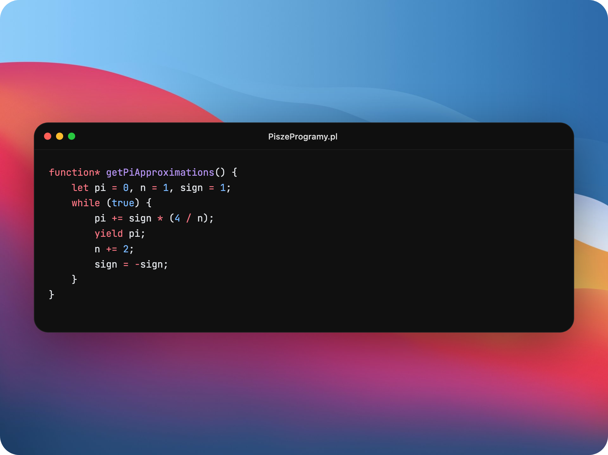

# Code Preview to Image 💻✨

> **Generator pięknych zrzutów ekranu kodu z systemową elegancją macOS, szklanymi efektami (glassmorphism) i pełną paletą kolorowania składni Shiki.**

Aplikacja umożliwia dynamiczną edycję kodu, automatyczne kolorowanie składni, personalizację tła (w tym wgrywanie własnych grafik), regulację przezroczystości okna terminala z zachowaniem rozmycia szkła oraz eksport gotowego renderu do wysokiej jakości pliku PNG za pomocą jednego kliknięcia.

🔗 **Podgląd online:** [https://code-preview-2-image.vercel.app/](https://code-preview-2-image.vercel.app/)

---

## 📸 Prezentacja Funkcjonalności

### 1. Pełna personalizacja (Język Python, własne tło, motyw)
Możesz swobodnie wybierać dowolne języki programowania oraz motywy kolorystyczne Shiki. Terminal automatycznie dostosowuje swój rozmiar (szerokość i wysokość) do długości Twojego kodu, bez sztucznego rozciągania.


### 2. Płynna regulacja przezroczystości (Opacity)
Reguluj stopień przezroczystości tła terminala za pomocą minimalistycznego suwaka macOS. Niezależnie od wybranej wartości, pod spodem zachowywany jest luksusowy efekt rozmycia macOS (glassmorphism blur), podczas gdy kod oraz elementy sterujące pozostają w 100% ostre i czytelne.

| Przezroczystość: 40% (`opacity-0.4`) | Przezroczystość: 100% (`opacity-1.0`) |
| :---: | :---: |
|  |  |

---

## 🚀 Główne Cechy Aplikacji

- **macOS Window Aesthetic:** Okno terminala posiada oryginalne, kultowe przyciski sterujące (zamknij, zminimalizuj, zmaksymalizuj) po lewej stronie oraz wyśrodkowany tytuł `"PiszeProgramy.pl"` na górnym pasku.
- **Szybkie kolorowanie składni Shiki:** Lokalnie zintegrowany silnik Shiki automatycznie i precyzyjnie koloruje kod (domyślnie TypeScript, motyw `github-dark`).
- **Inteligentny Spacing (Marginesy):** Margines tła wokół terminala automatycznie skaluje się w dół na mniejszych ekranach (smartfonach), chroniąc terminal przed ściśnięciem.
- **Wgrywanie Własnego Tła:** Kliknięcie dedykowanej ikony obrazka w panelu sterowania pozwala wybrać dowolną lokalną grafikę, która natychmiastowo staje się nowym tłem.
- **Formatowanie jak w IDE:** Wciśnięcie klawisza `Tab` w polu tekstowym wstawia dokładnie 4 spacje zamiast ucieczki fokusu z formularza.
- **Responsywność i Mobilność:** Na smartfonach czcionki kodu i elementy terminala skalują się płynnie (`clamp()`), gwarantując pełną czytelność. Panel sterowania ma postać nowoczesnego, pływającego Docka macOS o szerokości dostosowanej do ekranu.
- **Wysokiej Jakości Eksport:** Przycisk zapisu (podświetlony systemowym błękitem macOS) generuje i pobiera czysty, bezstratny plik PNG przy użyciu `html-to-image` i `downloadjs`.

---

## 🛠️ Technologie i Zależności

Projekt został zaprojektowany z myślą o minimalnej liczbie zależności i maksymalnej wydajności (Zero Bloat):
- **Vite:** Błyskawiczny bundler i środowisko uruchomieniowe.
- **CSS3 & HTML5:** Standardowe, czyste style bez zbędnych frameworków.
- **Shiki NPM:** Do profesjonalnego i dokładnego kolorowania składni w czasie rzeczywistym.
- **html-to-image:** Do generowania bezstratnych zrzutów ekranu.
- **downloadjs:** Do natychmiastowego pobierania plików w przeglądarce.

---

## 📦 Uruchomienie Lokalne

1. Zainstaluj zależności:
   ```bash
   npm install
   ```
2. Uruchom serwer deweloperski:
   ```bash
   npm run dev
   ```
3. Zbuduj wersję produkcyjną (katalog `dist`):
   ```bash
   npm run build
   ```
