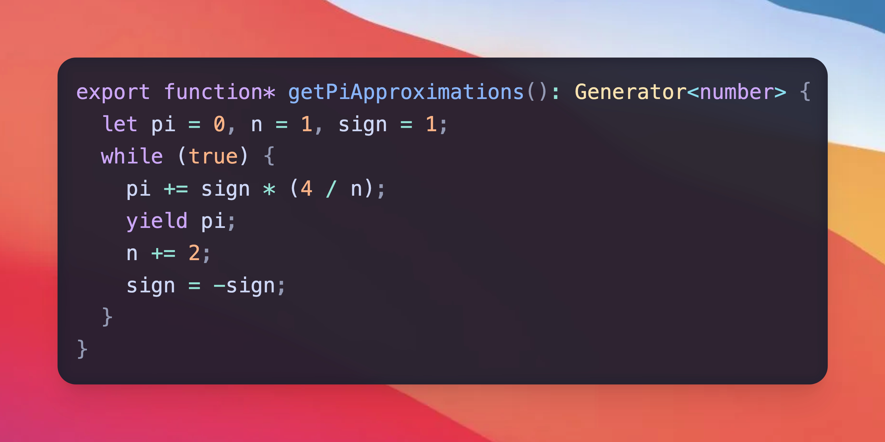

# Code Preview to Image
Code image generator - browser-based rendering
Vibe codded - $9.172 (gemini-flash-latest)



## Features
- Live preview with syntax highlighting via Shiki CDN
- Multiple themes (github-dark, monokai, solarized-light, etc.)
- Upload custom background image
- Adjust blur and padding
- Export to Image

## File Structure
```
index.html
styles.css
```

## Changes Made
This project formerly used Tailwind CSS for styling but has been modified to use standard CSS classes instead, reducing external dependencies and improving maintainability.

## Dependencies (via CDN)
- [Shiki](https://shiki.matsu.io/) for syntax highlighting
- [html-to-image](https://github.com/tsayen/html-to-image) for image export
- [downloadjs](https://github.com/rndme/download) for file download
